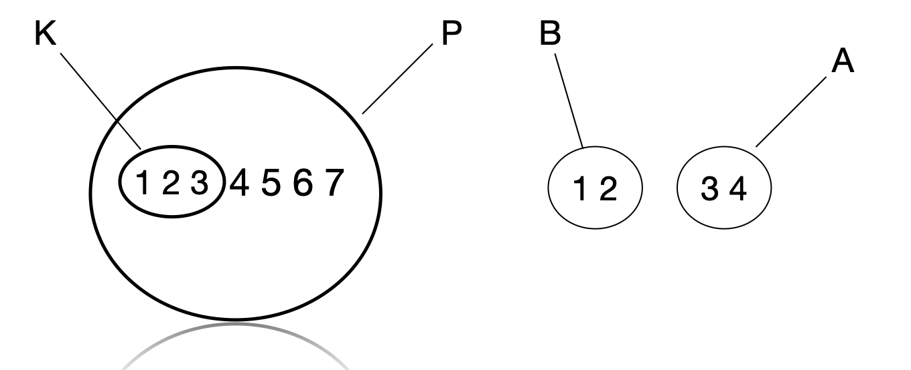

# Диаграммы Эйлера-Венна. Универсальное множество

## Диаграммы Эйлера-Венна

Для повышения наглядности представления множеств и отношений между ними используют **диаграммы Эйлера-Венна**. В них каждое множество изображается в виде геометрической фигуры (обычно круга или эллипса), причём взаимное расположение фигур отражает отношения между соответствующими множествами.

### Примеры

1. **Отношение включения**  
   Если множество $K$ является подмножеством множества $P$ ($K \subset P$), то на диаграмме фигура, изображающая $K$, полностью находится внутри фигуры, изображающей $P$.

2. **Непересекающиеся множества**  
   Если множества $A$ и $B$ не имеют общих элементов, их фигуры изображаются отдельно, без пересечения.

На рисунке ниже представлены оба случая. Слева изображены множества:
$P = \\{1, 2, 3, 4, 5, 6, 7\\}$ и $K = \\{1, 2, 3\\}$, причём $K \subset P$.  
Справа показаны два непересекающихся множества $A$ и $B$.

## Универсальное множество

**Определение.** *Универсальным множеством* (обозначается $U$ или $I$) называется множество, которое содержит все объекты, рассматриваемые в рамках конкретной задачи или теории. Все остальные множества в данном контексте являются подмножествами универсального множества.

Универсальное множество играет роль «универсума рассуждения» — своеобразной всеобъемлющей «коробки», из которой берутся элементы для формирования других множеств.

### Пример

Рассмотрим работу с целыми числами от 1 до 10. Зададим универсальное множество:
$$
U = \\{1, 2, 3, 4, 5, 6, 7, 8, 9, 10\\}.
$$

Определим два подмножества:
- $A$ — множество чётных чисел: $A = \\{2, 4, 6, 8, 10\\}$.
- $B$ — множество чисел, больших 7: $B = \\{8, 9, 10\\}$.

Все элементы множеств $A$ и $B$ принадлежат универсальному множеству $U$, что наглядно можно изобразить с помощью диаграммы Эйлера-Венна.