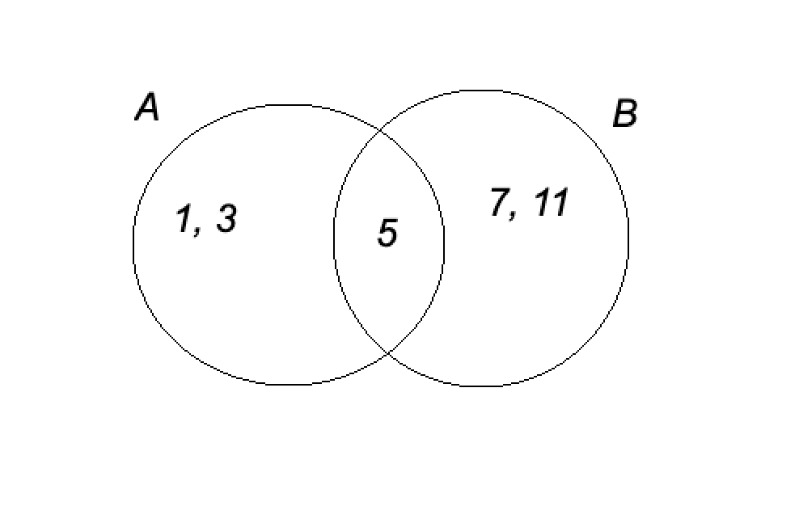

# 1.5. Пересечение множеств

## Определение

**Пересечением** (произведением) $n$ множеств $A_1, A_2, \ldots, A_n$ называется множество $A$, состоящее из всех элементов, которые принадлежат каждому из этих множеств.

Обозначение:
$A = A_1 \cap A_2 \cap \cdots \cap A_n$

Формальное определение с использованием логической символики:
$A = \{ x \mid x \in A_1 \land x \in A_2 \land \cdots \land x \in A_n \}$

где символ $\land$ обозначает логическую операцию **И** (конъюнкцию).

## Пример

Пусть даны множества:
$A = \\{1, 5, 7, 9, 0\\}, \quad B = \\{3, 0, 4, 7\\}, \quad C = \\{0, 7\\}.$

Их пересечение:
$A \cap B \cap C = \\{0, 7\\}.$

## Геометрическая интерпретация

На диаграммах Эйлера-Венна пересечение множеств изображается общей областью, принадлежащей всем рассматриваемым множествам.

Рассмотрим два множества:
$A = \\{1, 3, 5\\}, \quad B = \\{5, 7, 11\\}.$

Из диаграммы ниже видно, какие элементы являются общими для этих множеств:

На диаграмме видно, что $A \cap B = \\{5\\}$.

## Свойства операции пересечения

### 1. Коммутативность (перестановочность)
$$
A \cap B = B \cap A.
$$

Это свойство распространяется на любое конечное число множеств:
$A_1 \cap A_2 \cap \cdots \cap A_n = A_{\sigma(1)} \cap A_{\sigma(2)} \cap \cdots \cap A_{\sigma(n)},$
где $\sigma$ — произвольная перестановка индексов.

### 2. Ассоциативность (сочетательность)
$$
(A \cap B) \cap C = A \cap (B \cap C).
$$

Благодаря этому свойству можно опускать скобки и писать $A \cap B \cap C$.

### 3. Свойства, связанные с отношением включения

Если $A \subseteq B$ (в частности, если $A \subset B$), то $A \cap B = A$.

### 4. Свойства, связанные с особыми множествами

1. **Идемпотентность:** $A \cap A = A$.
2. **Пересечение с универсальным множеством:** $A \cap U = A$ (где $U$ — универсальное множество).
3. **Пересечение с пустым множеством:** $A \cap \varnothing = \varnothing$.

### 5. Дистрибутивные свойства

- **Дистрибутивность пересечения относительно объединения:**
  $A \cap (B \cup C) = (A \cap B) \cup (A \cap C).$

- **Дистрибутивность объединения относительно пересечения:**
  $A \cup (B \cap C) = (A \cup B) \cap (A \cup C).$

### 6. Приоритет операций

В выражениях, содержащих как объединение, так и пересечение, операция **пересечения имеет более высокий приоритет**, чем объединение. То есть:
$A \cup B \cap C = A \cup (B \cap C).$

Для изменения порядка выполнения операций необходимо использовать скобки:
$(A \cup B) \cap C.$
