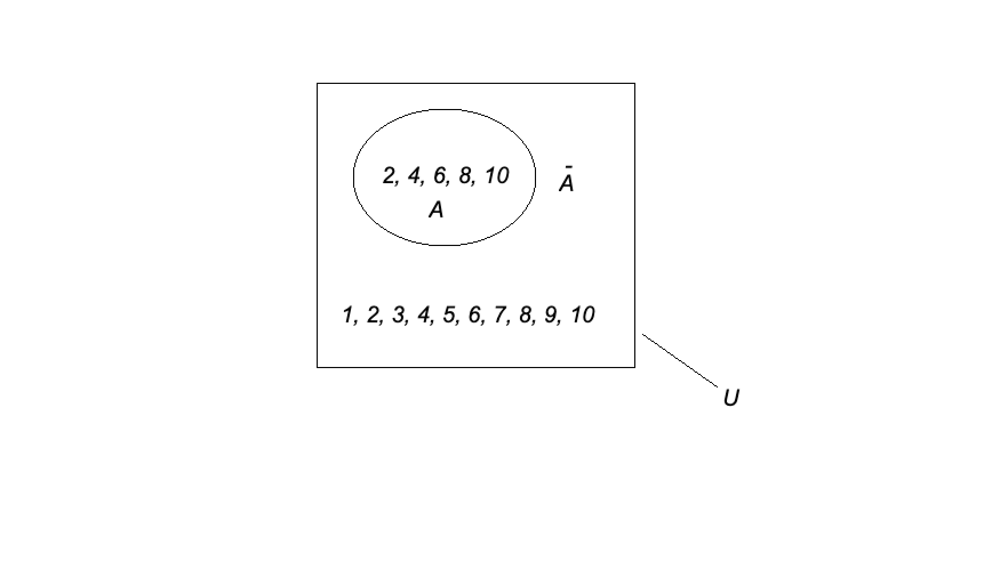

# 1.6. Дополнение множества

## Определение

Пусть $U$ — универсальное множество. **Дополнением** множества $A$ называется множество всех элементов $U$, которые не принадлежат $A$.

Обозначение: $\overline{A}$.

Формально:
$$
\overline{A} = \\{ x \mid x \in U \land x \notin A \\}.
$$

## Пример

Пусть:
$$
U = \\{ x \mid 1 \leq x \leq 10 \\} = \\{1, 2, 3, 4, 5, 6, 7, 8, 9, 10\\},
$$
$$
A = \\{2, 4, 6, 8, 10\\}.
$$

Тогда дополнение множества $A$:
$$
\overline{A} = \\{1, 3, 5, 7, 9\\}.
$$

На диаграмме Эйлера-Венна дополнение изображается областью универсального множества, не покрытой множеством $A$:

## Свойства дополнения

1. **Объединение с дополнением:**
   $$
   A \cup \overline{A} = U.
   $$

2. **Пересечение с дополнением:**
   $$
   A \cap \overline{A} = \emptyset.
   $$

3. **Двойное дополнение:**
   $$
   \overline{\overline{A}} = A.
   $$

4. **Дополнение пустого множества:**
   $$
   \overline{\emptyset} = U.
   $$

5. **Дополнение универсального множества:**
   $$
   \overline{U} = \emptyset.
   $$

## Относительное дополнение

Если $A \subseteq Q$, то **дополнением $A$ относительно $Q$** называется множество:
$$
\overline{A^Q} = \\{ x \mid x \in Q \land x \notin A \\}.
$$

### Пример

Пусть:
$$
A = \\{1, 2, 3\\}, \quad Q = \\{1, 2, 3, 4, 5\\}.
$$

Тогда:
$$
\overline{A^Q} = \\{4, 5\\}.
$$
